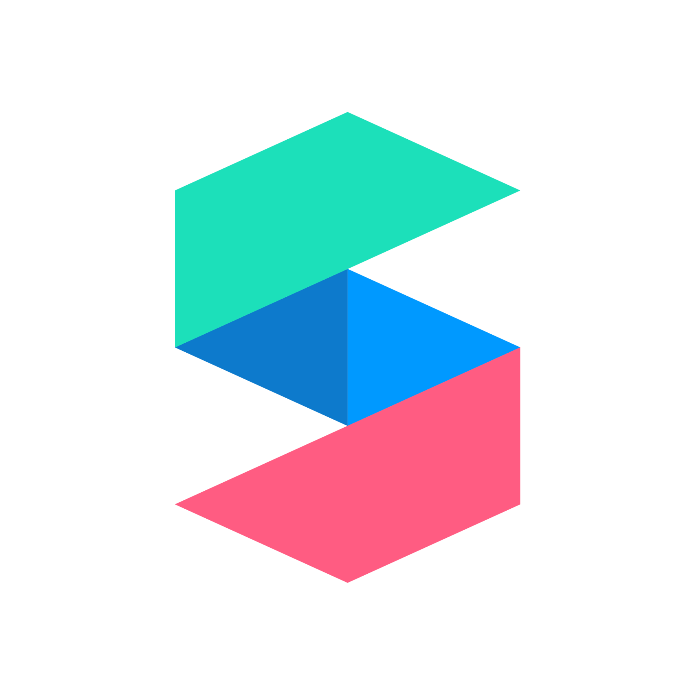

<!--
*** Thanks for checking out this README Template. If you have a suggestion that would
*** make this better, please fork the repo and create a pull request or simply open
*** an issue with the tag "enhancement".
*** Thanks again! Now go create something AMAZING! :D
***
***
***
*** To avoid retyping too much info. Do a search and replace for the following:
*** github_username, covid-tracker, twitter_handle, email
-->

<!-- PROJECT SHIELDS -->
<!--
*** I'm using markdown "reference style" links for readability.
*** Reference links are enclosed in brackets [ ] instead of parentheses ( ).
*** See the bottom of this document for the declaration of the reference variables
*** for contributors-url, forks-url, etc. This is an optional, concise syntax you may use.
*** https://www.markdownguide.org/basic-syntax/#reference-style-links
-->

[![Contributors][contributors-shield]][contributors-url]
[![Forks][forks-shield]][forks-url]
[![Stargazers][stars-shield]][stars-url]
[![Issues][issues-shield]][issues-url]
[![MIT License][license-shield]][license-url]
[![LinkedIn][linkedin-shield]][linkedin-url]

<!-- PROJECT LOGO -->
<br />
<p align="center">
  <a href="https://github.com/ehfazrezwan/spark-ar-neon-glow-on">
    
  </a>

  <h3 align="center">Spark AR - Neon Glow-On Animated Face Filter</h3>

  <p align="center">
  Using Spark AR to create animated face filters for Instagram, Facebook and Messenger.
    <br />
    <a href="https://github.com/ehfazrezwan/spark-ar-neon-glow-on"><strong>Explore the docs »</strong></a>
    <br />
    <br />
    <a href="https://www.instagram.com/ar/622384355624932/" target = "_blank">View Demo</a>
    ·
    <a href="https://github.com/ehfazrezwan/spark-ar-neon-glow-on/issues">Report Bug</a>
    ·
    <a href="https://github.com/ehfazrezwan/spark-ar-neon-glow-on/issues">Request Feature</a>
  </p>
</p>

<!-- TABLE OF CONTENTS -->

## Table of Contents

- [About the Project](#about-the-project)
  - [Built With](#built-with)
- [Getting Started](#getting-started)
  - [Installation](#installation)
- [Roadmap](#roadmap)
- [Contributing](#contributing)
- [License](#license)
- [Contact](#contact)
- [Acknowledgements](#acknowledgements)

<!-- ABOUT THE PROJECT -->

## About The Project

<br />  
<p align="center">
    
</p>
<br />

Spark AR used to build an animated face filter for Facebook, Instagram, and Messenger. The displayed demo is a result of animating directional lights on a face mesh.

### Built With

- [Spark AR](https://sparkar.facebook.com/ar-studio/)

<!-- GETTING STARTED -->

## Getting Started

To get a local copy up and running follow these simple steps.

### Installation

1. [Install Spark AR Studio](https://sparkar.facebook.com/ar-studio/learn/downloads/)

2. Clone the repo

```sh
git clone https://github.com/ehfazrezwan/spark-ar-neon-glow-on.git
```

3. Go into project directory

```sh
cd spark-ar-neon-glow-on
```

4. Open Light Mask.arproj in Spark AR Studio

<!-- ROADMAP -->

## Roadmap

See the [open issues](https://github.com/ehfazrezwan/spark-ar-neon-glow-on/issues) for a list of proposed features (and known issues).

<!-- CONTRIBUTING -->

## Contributing

Contributions are what make the open source community such an amazing place to be learn, inspire, and create. Any contributions you make are **greatly appreciated**.

1. Fork the Project
2. Create your Feature Branch (`git checkout -b feature/AmazingFeature`)
3. Commit your Changes (`git commit -m 'Add some AmazingFeature'`)
4. Push to the Branch (`git push origin feature/AmazingFeature`)
5. Open a Pull Request

<!-- LICENSE -->

## License

Distributed under the MIT License. See `LICENSE` for more information.

<!-- CONTACT -->

## Contact

Ehfaz Rezwan - [@ehfazrezwan](https://www.linkedin.com/in/ehfaz-rezwan/) - ehfaz.rezwan@gmail.com

Project Link: [https://github.com/ehfazrezwan/spark-ar-neon-glow-on](https://github.com/ehfazrezwan/spark-ar-neon-glow-on)

<!-- ACKNOWLEDGEMENTS -->

## Acknowledgements

- [Maru Studio](https://www.youtube.com/channel/UCcFy_yfaBHp2z-fceORWsWg)

<!-- MARKDOWN LINKS & IMAGES -->
<!-- https://www.markdownguide.org/basic-syntax/#reference-style-links -->

[contributors-shield]: https://img.shields.io/github/contributors/ehfazrezwan/spark-ar-neon-glow-on
[contributors-url]: https://github.com/ehfazrezwan/spark-ar-neon-glow-on/graphs/contributors
[forks-shield]: https://img.shields.io/github/forks/ehfazrezwan/spark-ar-neon-glow-on
[forks-url]: https://github.com/ehfazrezwan/spark-ar-neon-glow-on/network/members
[stars-shield]: https://img.shields.io/github/stars/ehfazrezwan/spark-ar-neon-glow-on
[stars-url]: https://github.com/ehfazrezwan/spark-ar-neon-glow-on/stargazers
[issues-shield]: https://img.shields.io/github/issues/ehfazrezwan/spark-ar-neon-glow-on
[issues-url]: https://github.com/ehfazrezwan/spark-ar-neon-glow-on/issues
[license-shield]: https://img.shields.io/github/license/ehfazrezwan/spark-ar-neon-glow-on
[license-url]: https://github.com/ehfazrezwan/spark-ar-neon-glow-on/blob/master/LICENSE.txt
[linkedin-shield]: https://img.shields.io/badge/-LinkedIn-black.svg?style=flat-square&logo=linkedin&colorB=555
[linkedin-url]: https://linkedin.com/in/ehfaz-rezwan
[product-screenshot]: images/LightMask.gif
